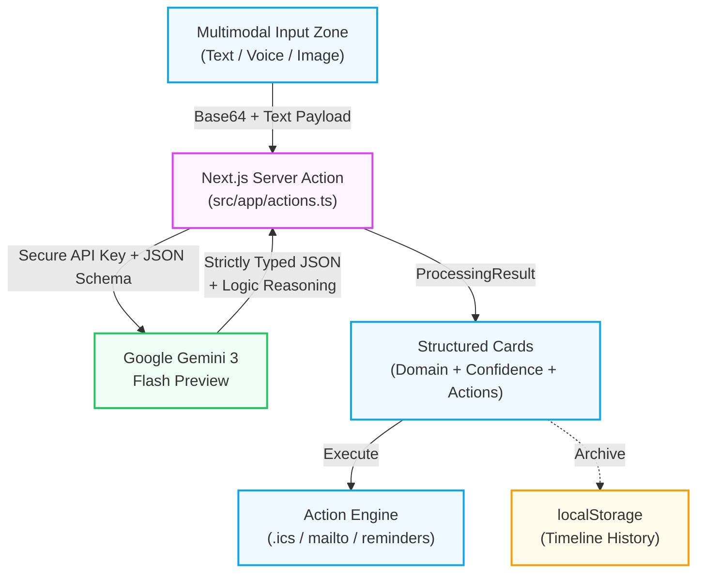
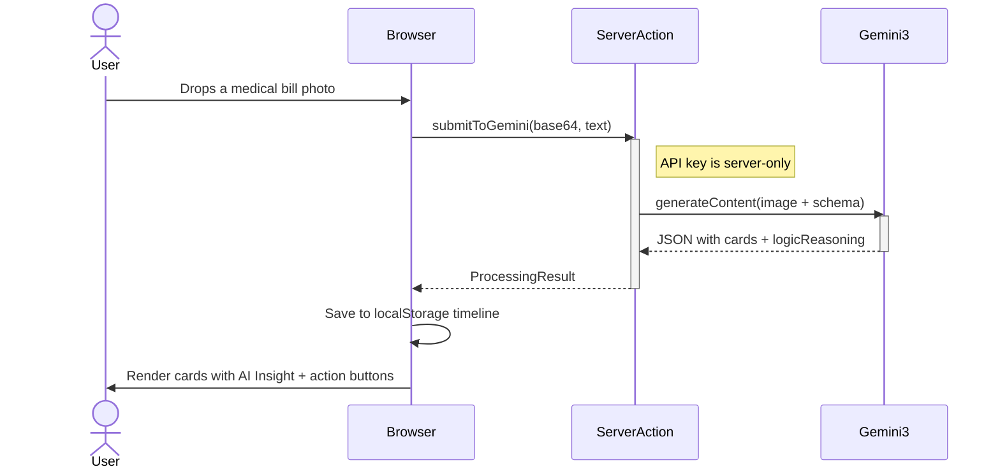
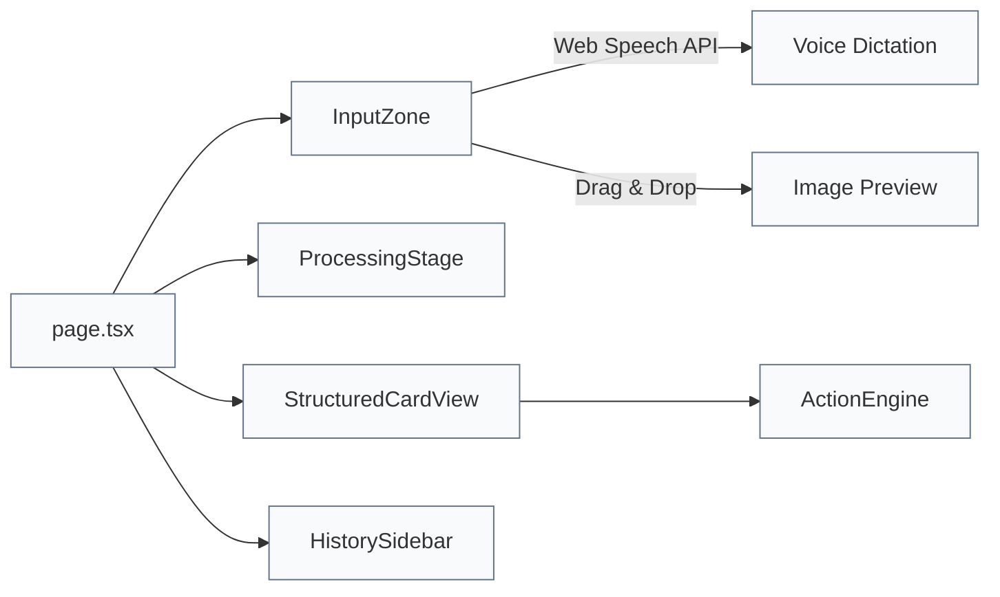

# LifeBridge

> **A universal bridge between messy human intent and structured life-serving actions.**

LifeBridge is a Next.js web application powered by **Google Gemini** that turns real-world clutter into clear next steps. The sections below explain *why* that matters—not only *how* it is built.

**Live Demo:** [https://promptwar-214175642765.europe-west1.run.app](https://promptwar-214175642765.europe-west1.run.app)

---

## Use case & impact

### The friction most software ignores

Day to day, people are handed **information they did not choose in a shape they cannot use**: pill bottles next to a discharge summary, a utility shutoff notice beside a pay stub, a school form mixed with work email, a letter from an agency written in dense language. Each item implies a **system**—a clinic portal, a billing desk, a registrar, a benefits office—that expects you to already know the rules, the timeline, and the vocabulary.

Closing the gap between *“I have this pile”* and *“I know what to do before the deadline”* usually costs **time, literacy, money, or access to a professional**. LifeBridge is aimed at everyone for whom that cost is too high.

### What LifeBridge does

It is a **single front door** for messy input. You bring **text, voice, or images**—no need to categorize them first. **Gemini** reads the content, sorts it into life domains (health, finance, logistics, legal, general), surfaces **warnings and confidence**, and explains its reasoning. The app then **closes the loop** with **concrete actions**: draft an email, add a calendar block, copy structured details, share a read-only **Bridge** link, or collaborate in **Family Mode** on a live Firestore dashboard.

It is not a filing cabinet. It is a **path from chaos to the next tap**.

### Who it is for

- **Older adults and caregivers** juggling medications, appointments, and paperwork without a full-time care coordinator.  
- **Anyone navigating bureaucracy** in a non-native language or unfamiliar format.  
- **Households under pressure**—bills, notices, and school requirements arriving faster than they can be decoded.  
- **People who cannot lean on paid help** for every letter, form, or statement.  
- **Families coordinating together** when one person has the photo, another has the account login, and nobody has a spare hour to reconcile them.

### The bridge, literally

On one side: **human reality**—photos, rambling voice notes, screenshots, pasted text.  
In the middle: **structured reasoning** with Gemini (schema-bound outputs and explicit logic).  
On the other side: **outputs you can act on**—cards, reminders, drafts, and shareable summaries aligned with how real institutions expect information to look.

> **One-line pitch:** *LifeBridge can take a photo of prescription labels and visit notes and return a structured medication-oriented summary with risk flags and suggested follow-ups—so the next step is obvious, not another hour of guesswork.*

---

## 📋 Challenge Vertical & Approach

### Chosen Vertical: Life Management Assistant

LifeBridge operates as a **context-aware life management assistant** that bridges the gap between unstructured human inputs and structured, executable outputs across critical life domains.

### Approach & Logic

The solution follows a three-phase pipeline:

1. **Capture** — Accept multimodal input (typed text, voice dictation, or drag-and-drop images) without requiring the user to pre-categorize anything.
2. **Reason** — Route the raw payload to **Gemini 3 Flash Preview** with a strictly enforced JSON Schema. The model categorizes inputs into domains, assigns confidence scores, flags warnings, and generates an explicit **Logic Reasoning** explanation for every decision.
3. **Act & Share** — Render structured output cards with one-tap action buttons. Users can generate **Bridge Share** links (7-day TTL) for read-only branded views with QR codes.
4. **Collaborate** — Enable **Family Mode** using a 6-digit room code system. This creates a real-time **Family Health Dashboard** powered by **Google Firestore**, where multiple members can contribute and sync data instantly.

### How the Solution Works

A user drops a photo of a medical bill. The image is Base64-encoded and sent securely to Gemini 3. Gemini returns categorized items with AI reasoning. In solo mode, this is archived locally. In **Family Mode**, characters join a room; every time a document is processed, it is pushed to a Firestore sub-collection. All room members see a live, merged dashboard grouped by domain (e.g., Mom's labs + Dad's insurance). Users can also click "Share" to generate a unique Firestore-backed URL that renders a branded read-only card with a QR code for easy mobile viewing.

### Assumptions Made

- Users have access to a modern browser supporting the Web Speech API (Chrome, Edge, Safari).
- The Gemini API key is provisioned via Google AI Studio (free tier, no credit card required).
- Sensitive documents processed through the API are subject to Google's standard data handling policies. No user data is stored on our servers.
- The application prioritizes speed over exhaustive validation—Gemini's confidence score and reasoning help users decide whether to trust the output.

---

## 🏆 Competition Deliverables

| Criteria | How LifeBridge Delivers |
|---|---|
| **Smart Dynamic Assistant** | Multimodal input (text, image, voice) processed by Gemini 3 Flash Preview with confidence-weighted, domain-categorized structured outputs. |
| **Logical Decision Making** | Every output card includes an explicit **AI Insight** with the model's chain-of-thought reasoning—why it flagged a warning, chose a domain, or suggested a specific action. |
| **Effective Google Services** | `@google/genai` SDK (Gemini 3), Google Cloud Run (serverless Docker deployment), Google Fonts (Inter, Merriweather). |
| **Real-World Usability** | Targets universal "navigational friction"—turning dense documents into single-tap actions for elderly patients, immigrants, busy parents, or anyone overwhelmed by bureaucracy. |
| **Clean & Maintainable Code** | TypeScript throughout, strict interfaces, Server Action isolation, modular component architecture, full Vitest test suite. |

---

## 🏗 Architecture & Data Flow

LifeBridge employs a strictly structured Server Action setup. The Google Gemini API key is never exposed to the client-side JavaScript bundle, ensuring secure and private parsing of sensitive documents.

### System Architecture


### Request Lifecycle


### Component Tree


---

## 📊 Evaluation Focus Areas

### Code Quality
- **TypeScript** with strict interfaces (`src/lib/types.ts`) — zero `any` types in application logic.
- **Modular architecture** — one responsibility per component (`InputZone`, `ProcessingStage`, `StructuredCard`, `ActionEngine`, `HistorySidebar`).
- **Server/client boundary** — AI logic isolated in `src/lib/gemini.ts`, called only through the Server Action in `src/app/actions.ts`.

### Security
- **API key isolation** — `GEMINI_API_KEY` is read at runtime inside the Server Action function scope; never bundled into the client JavaScript.
- **No database exposure** — all user data persists exclusively in the browser's `localStorage`.
- **Input sanitization** — all user text is passed as structured prompt parameters, not interpolated into executable code.
- **`.env.example`** provided; `.env*` files are in `.gitignore`.

### Efficiency
- **Next.js `standalone` output** — only traces required files, producing a minimal Docker image for Cloud Run.
- **Multi-stage Docker build** — Alpine Linux base, separate `deps` / `builder` / `runner` stages for aggressive layer caching.
- **Low-temperature inference** (`0.2`) — deterministic outputs minimize retry costs.
- **`/api/health` endpoint** — ensures Cloud Run's auto-scaler routes traffic only to healthy instances.

### Testing
- **Vitest** test suite with mocked `@google/genai` SDK.
- **Unit tests** — validates Gemini response parsing, schema adherence, and error handling (`src/__tests__/gemini.test.ts`).
- **Component tests** — validates ActionEngine rendering with React Testing Library (`src/__tests__/ActionEngine.test.tsx`).
- Run with: `npm run test`

### Accessibility
- **Semantic HTML** — `<button>`, `<main>`, `<nav>`, `<header>` used throughout; no `<div onClick>`.
- **ARIA live regions** — screen readers are notified when processing begins and results appear.
- **Keyboard navigation** — all interactive elements are focusable and operable via Tab/Enter.
- **Color contrast** — Premium green light/dark themes use foreground-on-background pairings intended to meet WCAG AA for body text.
- **Status indicators** — warning/success states use both color AND text labels (never color alone).

### Google Services Integration
| Service | Usage |
|---|---|
| **Gemini 3 Flash Preview** | Core AI engine — multimodal content generation with enforced JSON Schema output and explicit reasoning. |
| **Google Firestore** | Real-time database — powers **Family Mode** (room sync and member tracking) and **Bridge Share** (persistent shared links). |
| **Google Cloud Run** | Production deployment — serverless, auto-scaling, zero-downtime Docker containers in `europe-west1`. |
| **Google Fonts** | Typography — Inter (UI), Merriweather (headings) loaded via `next/font`. |
| **Google AI Studio** | API key provisioning — free tier, no credit card required. |

---

## ⚡ Tech Stack

| Layer | Technology |
|---|---|
| Frontend | Next.js 15 (App Router), React 19 |
| Styling | Tailwind CSS 4 with custom design tokens |
| AI | `@google/genai` — Gemini 3 Flash Preview |
| Testing | Vitest, React Testing Library |
| Deployment | Google Cloud Run (Docker), Vercel |
| Persistence | Browser localStorage |
| Icons | lucide-react |
| Utilities | file-saver (.ics generation) |

---

## 🚀 Local Development Setup

```bash
# 1. Clone
git clone https://github.com/DecentralizedJM/PromptWar.git
cd PromptWar

# 2. Install
npm install

# Configure
cp .env.example .env.local
# Add your Gemini key and Firebase credentials:
# GEMINI_API_KEY=...
# NEXT_PUBLIC_FIREBASE_API_KEY=...
# ... (Find other vars in .env.example)
# Get a free gemini key at https://aistudio.google.com/apikey

# 4. Run
npm run dev
# Open http://localhost:3000

# 5. Test
npm run test
```

---

## ☁️ Deployment

### Google Cloud Run (Production)
LifeBridge is containerized with a multi-stage `Dockerfile` and includes a `/api/health` endpoint for load balancer health checks.

```bash
gcloud run deploy promptwar \
  --source . \
  --region europe-west1 \
  --allow-unauthenticated \
  --set-env-vars="GEMINI_API_KEY=your_key"
```

GitHub-connected Cloud Build triggers auto-deploy on push to `main`.

### Vercel (Alternative)
```bash
npm run deploy  # alias for vercel --prod
```
Set `GEMINI_API_KEY` in the Vercel dashboard under Environment Variables.

---

## 📜 License

This project is licensed under the [MIT License](LICENSE).
