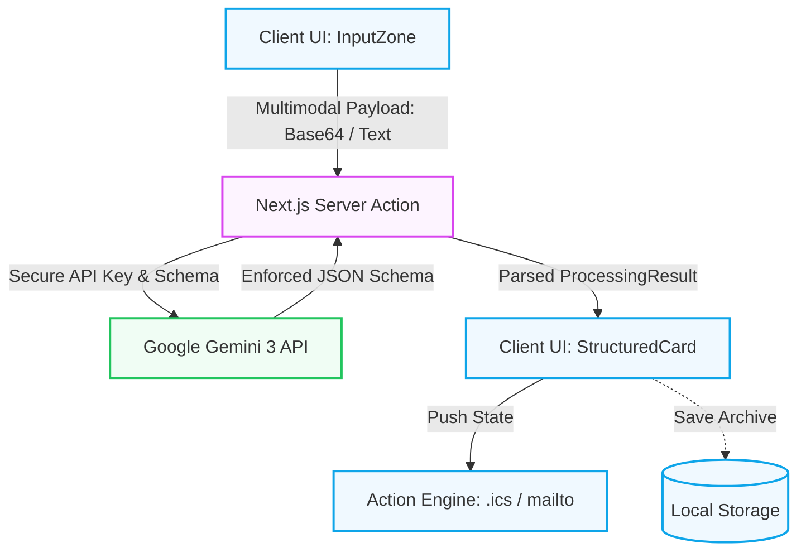
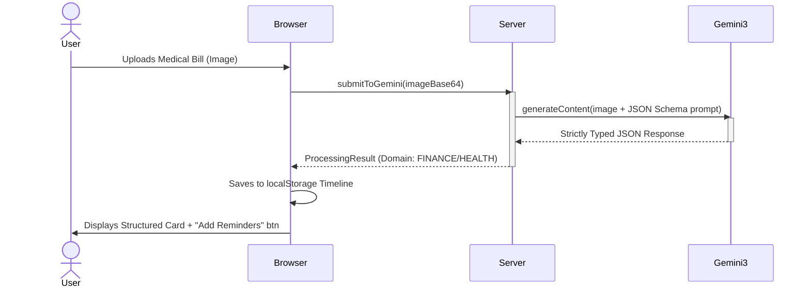

# LifeBridge

> **A universal bridge between messy human intent and structured life-serving actions.**

LifeBridge is a Next.js web application powered by **Gemini 3**. It targets a specific, high-friction problem: navigating confusing real-world information (prescription details, legal letters, dense utility bills). By photographing, dragging, or dictating this raw data to LifeBridge, the application instantly structures, categorizes, and provides single-tap executable actions (e.g., adding a deadline to a calendar, drafting an email response) strictly via local, secure processes.

## 🎯 Core Problem Statement
The modern world runs on systems that require expertise to navigate, yet present that information chaotically to the end user. LifeBridge eliminates that friction entirely.
**Success State:** Users throw a mess of photos or voice notes at the UI, and within 3 seconds, they receive beautifully categorized Next Steps securely.

---

## 🏆 Key Competition Deliverables

- **Smart Dynamic Assistant:** Powered by **Gemini 3 Flash Preview**, the assistant provides multimodal support for text, images, and voice, with a confidence-weighted output.
- **Logical Decision Making:** Every structured output includes a **Logic Reasoning** explanation, demonstrating the model's ability to contextualize and flag risks (e.g., medical contraindications or urgent financial deadlines).
- **Effective Google Services Integration:** Leverages the latest `@google/genai` SDK and is pre-configured for **Google Cloud Run** using a standalone multi-stage Docker architecture.
- **Real-World Usability:** Focuses on the "LifeBridge" concept—reducing the friction of navigating dense, bureaucratic, or technical information for everyday users.
- **Clean & Maintainable:** Built with **TypeScript**, **Next.js 15 Server Actions**, and **React 19**, with a full **Vitest** testing suite for CI/CD readiness.

---

## 🏗 Architecture & Data Flow

LifeBridge employs a strictly structured Server Action setup. The Google Gemini API key is never exposed to the client-side JavaScript bundle, ensuring secure and private parsing of sensitive documents.

### System Architecture Diagram


### Process Flow Diagram


---

## ⚡ Tech Stack & Libraries

- **Frontend Core:** Next.js 15 (App Router), React 19
- **Styling:** Vanilla Tailwind CSS (Performance-oriented, pure CSS animations)
- **AI Processing:** `@google/genai` (Gemini 3 Flash Preview SDK)
- **Testing:** Vitest & React Testing Library (Unit + Component testing suites)
- **Data Persistence:** Browser `LocalStorage` (zero-latency, absolute privacy for history logs)
- **Icons & UI:** `lucide-react`
- **Utility:** `file-saver` (For local standard `.ics` buffer generation)

### 💳 Google Services & Free Tiers
*This application relies on the Google Gemini API to operate. You must provide your own API key.*
- **Gemini API:** Utilizes the Free Tier (Up to 15 Requests Per Minute / 1 million tokens per minute limit). Absolutely free of charge for prototyping. No credit card required.

---

## 🧪 Testing Coverage
LifeBridge includes competitive test coverage validating core multimodal parsing and component rendering safely.

### Running Tests
```bash
npm run test
```
*(Tests use Vitest against the mock `@google/genai` logic and structural layout renders).*

---

## 🚀 Local Development Setup

1. **Clone the repository:**
```bash
git clone https://github.com/DecentralizedJM/PromptWar.git
cd PromptWar
```

2. **Install all dependencies:**
```bash
npm install
```

3. **Configure the Environment:**
Copy the placeholder `.env.example` file to create your own localized `.env.local`:
```bash
cp .env.example .env.local
```
Inside `.env.local`, set your Gemini API Data Key:
```text
GEMINI_API_KEY=your_gemini_api_key_here
```
*(You can obtain a free key at [Google AI Studio](https://aistudio.google.com/apikey))*

4. **Run the local development server:**
```bash
npm run dev
```
Open `http://localhost:3000` to view the app.

---

## ☁️ Deployment (Cloud Run & Vercel)

This application is structurally optimized and pre-configured for zero-friction serverless deployments.

### Google Cloud Run (Recommended)
LifeBridge is fully containerized with a highly optimized multi-stage `Dockerfile` creating a standalone Next.js image with an auto-scaler health check (`/api/health`).

If you have connected your GitHub to Google Cloud Build, pushing `main` will auto-deploy. Or deploy manually:
```bash
gcloud run deploy lifebridge --source . --region europe-west1 --allow-unauthenticated --set-env-vars="GEMINI_API_KEY=your_key"
```

### Vercel Deployment

Ensure you have the Vercel CLI installed globally (`npm i -g vercel`), then run:
```bash
npm run deploy
```
*(Alias for `vercel --prod`)*

### Vercel Dashboard Method:
1. Connect your GitHub repository to Vercel.
2. Under "Environment Variables", assign `GEMINI_API_KEY` to your generated Google AI Studio API key.
3. Click **Deploy**.

**Custom Domain Instructions:**
Once deployed on Vercel, navigate to **Settings > Domains**. Enter your custom domain (e.g., `lifebridge.app`), and Vercel will automatically provision specific A Records or CNAME configurations for you to add to your DNS provider (e.g., Cloudflare or Namecheap). SSL provisioning is handled automatically.

---

## 🔒 Security & Privacy Guarantees
- The Gemini generation executes entirely on a Next.js Server Action (`src/lib/gemini.ts`), shielding your `GEMINI_API_KEY` from the client.
- Your timeline data and generated documents are stored exclusively in the browser\'s `localStorage` — no databases are exposed or retained in the backend.

---

## 📜 License
This project is licensed under the [MIT License](LICENSE) - see the LICENSE file for details. Built and submitted for competition by [PromptSmith / Antigravity Agent].
